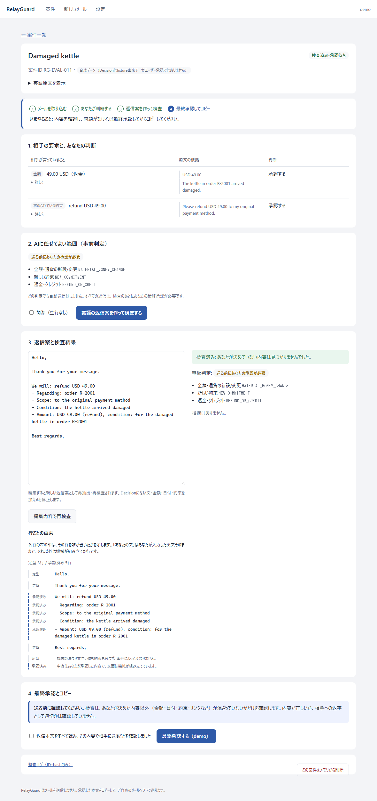
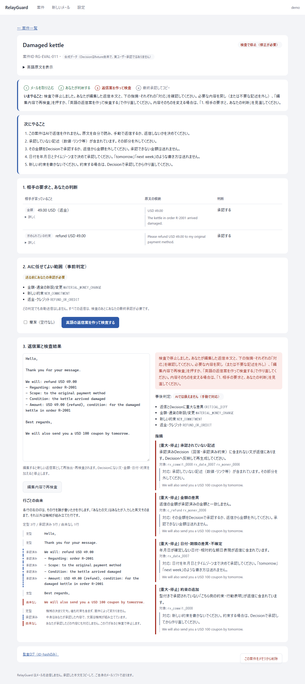

# RelayGuard — 英文メール返信の「約束しすぎ」を止めるローカル確認ツール

> **Stops over-promising in English e-mail replies.** A human approves each item (amount, deadline, promise); anything else that slips into the reply makes the check stop. Deterministic Python rules decide, not an LLM. No e-mail is sent. Source-available, noncommercial use only.

人が承認した項目（金額・期限・約束など）以外が英文返信に1語でも混ざると、検査が止まります。止めるかどうかを決めるのはLLMではなく、Pythonの決定論的なルールです。メールは送信しません。

| | |
|---|---|
| 動作 | Windows向けローカルツール（ブラウザ画面）。外部通信なしで使えます |
| 実装 | Python 3.14、FastAPI + Jinja2、JSON Schema |
| 検証 | `pytest` 2,793件・`ruff`・`mypy --strict` が合格（開発者による検証。独立監査・実メール評価は未実施） |
| ライセンス | [PolyForm Strict 1.0.0](LICENSE)（非商用のみ・再配布不可） |

### 画面（架空データ）

**① 承認：相手の要求を、利用者が項目ごとに判断します**



**② 停止：承認していない約束（クーポン）を足すと、理由つきで止まります**



---

## 短い説明（何をするツールか・売るために作っているか）

RelayGuard は、日本語しか十分に読めない人が英語のメールに返信するための Windows 用ローカルツールです。Claude がメールを読み取って要点を日本語で示し、利用者が項目ごとに承認します。英語の返信は、承認した内容だけから組み立てます。承認していない金額・日付・約束・返金・リンクが混ざっていれば、プログラムの検査で止めます。メールの送信機能はなく、最後は利用者がコピーして自分で送ります。

売ることが第一の目的ではありません。作者自身が困っている問題（読めない言語で、AIが何を約束したか確かめられない）を解くために作り、実運用で役立つ形にして配布します。対価を受け取れる形も用意しますが、売れるかどうかを先に証明してから作る方針はとっていません（製品オーナーの決定、2026-09-23）。

現時点で行ったのは作者による検証だけです。独立した第三者による検査や、実際のメールでの評価はまだです。

---

日本語話者が海外の取引先・顧客へ英語で返信するとき、**人間が承認した内容だけ**を英文にし、
**承認していない金額・日付・約束・保証・返金・個人情報が1語でも混ざったら停止**する、ローカル専用のレビューツールです。

- メールは送信しません。最終承認した本文を**コピーして自分のメールソフトで送る**ところまでです。
- 判定・検査はPythonの決定論的なコードです（LLMに安全判定をさせません）。
- 「安全です」とは表示しません。表示は「定義済み検査を通過」だけです。

## 何ができるか

1. **解釈**: 英文メールを構造化（金額・期限・質問・求められている約束・怒り・法的主張など）。原文の完全一致引用がない解釈は受け付けません。
   - 取込み方法: `.eml`ファイル / **自分で読み取って登録（APIキー不要・外部送信なし）** / 合成サンプル / JSON / （任意・起動時に有効化）Claudeによる自動解釈
2. **Decision Sheet（日本語）**: 項目ごとに「承認する／保留／回答しない」を選び、質問への英語回答を書く。未選択は承認扱いになりません。
3. **事前判定 L0〜L3**: 法的主張・インジェクション・重大な不明値はL3（AI処理停止）。返金・値引き・新しい約束などはL2。
4. **英語返信の生成**: 承認済みの内容だけから決定論的に生成（L3は生成しない）。
5. **独立検査**: 返信を、Decisionを見ない抽出器で読み直し、承認内容と型付きで比較。
   - 承認外の文・金額・通貨（`$`はUSDと推測しない）・日付（「tomorrow」等の相対表現も停止）・数量・保証・返金・値引き・解約・ライセンス・第三者メールアドレス・リンク（承認済み回答の中でも不可）・指示文・法的表現 → 停止（重大ならL3）
   - 全角・ゼロ幅文字・類似字形・1文字ずつ分割といった難読化も、折りたたんでから判定します
   - 承認済みの約束・条件・金額・期限・必要な回答の欠落 → 停止
6. **次にやること の表示**: 停止したときは、指摘ごとに「何をすれば解消するか」を日本語で表示します。相手が何も求めていないメール（お知らせ・宣伝）には、返信不要の可能性がある旨を表示します（判定は止めません）。
7. **最終承認 → コピー**: 検査を通過した版だけを、操作者が本文確認のうえ承認。1文字でも編集すると再検査になり、以前の承認は無効。
8. **監査ログ**: ID とハッシュだけの改ざん検知チェーン（本文・個人情報は保存しない）。

## 配布版（Python不要・Windows）

> **このリポジトリには、ビルド済みの配布物（ZIP・exe）を含めていません。** 以下は、配布版を作る・使う場合の仕様の説明です。ソースから試す場合は「すぐ試す」の手順を使ってください。

`RelayGuard-<version>-win64.zip` を展開し、`RelayGuard.exe` をダブルクリックするとブラウザが開きます（使い方は同梱の `README-ja.txt`）。

配布物のビルド（開発者向け。PyInstallerが必要）:

```bash
.venv/Scripts/python.exe -m pip install pyinstaller
```

```bash
.venv/Scripts/python.exe scripts/build_windows.py
```

ビルドは次のいずれかで失敗し、zipを作りません: 同梱したRelayGuardのソース・スキーマ・テンプレートがチェックアウトとバイト一致しない／RelayGuardのコードがバイナリ内に固められている（検証済みソースと実行コードの不一致を防ぐため、RelayGuard自身は `.py` のまま同梱）／起動スモークテスト失敗。出力は `dist/RelayGuard/`（`SHA256SUMS.txt` 付き）と `dist/RelayGuard-<version>-win64.zip`。

未対応: コード署名（初回にWindows SmartScreenの警告が出る）、自動更新、インストーラ形式、macOS。

## すぐ試す（ソースから / Windows / Python 3.14）

```bash
python -m venv .venv
```

```bash
.venv/Scripts/python.exe -m pip install jsonschema fastapi jinja2 python-multipart uvicorn
```

```bash
.venv/Scripts/python.exe scripts/run_reviewer.py --operator your_name
```

表示された `http://127.0.0.1:8765/login?token=...` をブラウザで開き、「サンプル（合成データ）を開く」から例えば `RG-EVAL-011.input.json`（破損したケトルの返金）を選んでください。

コマンドラインのデモ（生成→検査→承認と、改ざん攻撃の停止結果を表示）:

```bash
.venv/Scripts/python.exe scripts/demo_full_relayguard.py
```

### Claudeによる自動解釈（任意）

```bash
.venv/Scripts/python.exe -m pip install anthropic
```

```bash
.venv/Scripts/python.exe scripts/run_reviewer.py --operator your_name --enable-llm-interpreter
```

起動するウィンドウで環境変数 `ANTHROPIC_API_KEY` を設定しておく必要があります。貼り付けたメール本文はAnthropic APIへ送信されます。実メールで使う前に、社内のデータ取扱い条件を確認してください。画面でも毎回同意を求めます。

## メールファイル（.eml）から本文を取り出す

トップ画面で `.eml` を選ぶと、装飾を除いた本文テキストだけを取り出します。ファイルはこのPCの中だけで処理し、どこにも送信しません（追跡用の画像・リンクは読み込みません）。添付は名前だけを表示し、中身は読みません。

## 検証コマンド（開発者向け）

```bash
.venv/Scripts/python.exe -m pytest
```

```bash
.venv/Scripts/python.exe -m ruff check .
```

```bash
.venv/Scripts/python.exe -m mypy --config-file pyproject.toml
```

承認済み回答行に未承認の値を隠す攻撃の探索（見逃しがあれば終了コード1）:

```bash
.venv/Scripts/python.exe scripts/fuzz_extractor.py
```

## APIキーなしで使う（自分で読み取って登録する）

トップ画面の「自分で読み取って登録する」で、メールを自分で読み、返信に関係する項目（質問・金額・期限・求められている約束）だけを登録します。各項目には**原文からの完全一致の引用**が必要で、一致しない引用は受け付けません。値を空にすれば「不明」として扱い、推測はしません。

外部への送信もAPIキーも不要で、この経路だけでも生成・検査・最終承認まで通ります。Claudeによる自動解釈は、この作業を省くための任意の機能です。

## 実メールで試すとき

`trial/real_mail_trial.md` に記録用のテンプレートがあります。英文メール5通を通し、先に決めた基準で「自分の役に立つか」を判定するためのものです。

## 限界（正直に）

- 返信は定型構造の英文です（自然な言い回しの自動作文はしません）。承認外の言い回しを足すと検査で止まる設計です。
- 自由文の「意味」は検証していません。安全性は「承認済みの行だけで構成されているか」＋型付き値の照合で担保しています。
- 添付ファイルは解析しません（添付依存はL3）。英語メール→英語返信のみ。
- 案件はプロセスのメモリ上だけに保持（既定24時間、終了で消去）。複数ユーザー・権限管理・永続化はありません。
- 評価は合成データでの開発用検証です。独立QA・実運用データでの評価は未実施です。

## 構成

| パス | 役割 |
|---|---|
| `packages/core/relayguard` | 構造契約・事前判定（SG-001）・Generator・Reply Extractor・型付きDiff・Verifier・Final Approval |
| `packages/ui/relayguard_ui` | ローカルWeb UI・アプリケーションサービス・任意のClaude解釈アダプタ |
| `packages/evaluation` | オフライン評価ハーネス（100件評価セット） |
| `Relay_Guard/SPEC_INDEX.md` | 製品仕様の入口 |
| `eval/`, `fixtures/`, `trial/` | 評価セット・保存したrun結果・テスト入力・試用メモ（`trial/counterparty` は架空の相手メール） |

## ライセンスと公開範囲

**PolyForm Strict License 1.0.0**（[LICENSE](LICENSE)）。ソースは公開していますが、オープンソースではありません。**非商用の目的での利用に限り**、**再配布と、改変・派生物の作成はできません**。商用での利用が必要な場合は、著作権者（ray-works-jp）へ別途ご相談ください。

- GitHub上での閲覧と、GitHubの利用規約が認める範囲（フォークなど）は、このリポジトリの公開に伴うものです。ライセンス自体は上記のとおり再配布を許可していません。
- ビルド済みの配布物（`RelayGuard-*-win64.zip`）と、AI作業の引き継ぎ資料（`handoff/`）・作業指示書は、このリポジトリに含めていません。`docs/` の中の `handoff/` への参照は、そのためリンク切れです。
- 開発はAIコーディングエージェントを使って行い、設計判断と検証は作者が行っています。独立した第三者の検査は未実施です（上の「限界」を参照）。
