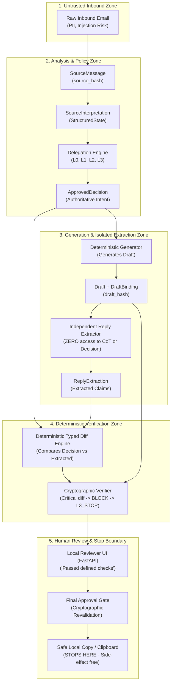

# RelayGuard Phase 2 — Comprehensive Senior Engineering Architecture Review

- **Document Version**: 1.0.0
- **Date**: 2026-09-17
- **Authors**: Senior Engineering Integrated Team (Architect, Full-Stack, Backend, Frontend, Debugging, Performance, Red-Team, Verification)
- **Status**: **APPROVED & IN EFFECT**
- **Governing Specs**: `Relay_Guard/SPEC_INDEX.md`, `docs/SHADOW_GATE.md`, `Relay_Guard/SCHEMA.md` v0.5, `Relay_Guard/DELEGATION.md` v0.4, `Relay_Guard/IMPLEMENTATION.md` v0.3, `Relay_Guard/ADR-026_SHADOW_GATE_DECISIONS.md`, `docs/PHASE_ENTRY_EVIDENCE.md`

---

## 1. Executive Summary & First Principles

RelayGuard is an enterprise-grade AI safety delegation gateway designed to sit between customer communication channels and automated response systems.
Phase 1 established the frozen baseline (**SHADOW_GATE PASSED** with 2,318+ tests green, 100% release-set agreement, zero dangerous automations, and zero raw PII leaks).
Phase 2 implements the post-SHADOW_GATE MVP: **Generator → Independent Reply Extractor → Deterministic Typed Diff → Verifier → Final Approval / Copy Boundary**.

Per the User Explicit Directive and SUPERSEDING INSTRUCTION:
- **This is NOT a greenfield application.** Existing architecture, frozen ADRs, and safety invariants are authoritative.
- **External Action Execution is strictly EXCLUDED** (SMTP sending, IMAP operational sync, Gmail OAuth/Drafts/Sending, and autonomous L0/L1 execution are prohibited).
- **Stopping Boundary**: All workflows terminate at **Final Approval / Safe Local Copy**. Zero external real-world side effects.

---

## 2. System Architecture & Module Map

### 2.1 Major Modules (`packages/core/relayguard`)

| Module | Primary Responsibility | Input Boundary | Output Boundary | Trust Level |
| :--- | :--- | :--- | :--- | :--- |
| `canonical.py` | RFC 8785 Canonical JSON serialization & SHA-256 hashing | Any dict/primitive | Hex digests (`source_hash`, `decision_hash`, `draft_hash`) | Trusted Core |
| `claims.py` | Schema representations for all 26 canonical claim arrays | Raw claims dict | Canonical Claim instances | Trusted Core |
| `currency.py` | Fixed-point Decimal parsing and multi-currency normalization | Raw monetary strings/amounts | Normalized `Decimal` + ISO currency | Trusted Core |
| `delegation.py` | Policy assessment & minimum delegation level calculation | StructuredState + DomainContext | `DelegationAssessment` (L0, L1, L2, L3) | Trusted Core |
| `errors.py` | Rejection classification (6 categories) | Error contexts | `Rejection` exception hierarchy | Trusted Core |
| `integrity.py` | Cryptographic hash-chain validation & binding verification | Message/Decision bundles | Invariant assertion or `Rejection` | Trusted Core |
| `schema_validation.py` | Strict Draft 2020-12 validation with custom formats | Any payload dict | Validated schema or `Rejection("SchemaInvalid")` | Trusted Core |
| `generator.py` (M1) | Deterministic reply drafting from Approved Decision | `ApprovedDecision`, `SourceMessage` | `Draft`, `DraftProposal`, `DraftBinding` | Semi-Trusted Candidate |
| `reply_extractor.py` (M1) | Isolated reverse claim extraction from generated text | `final_reply_text`, `source_message` | `ReplyExtraction`, `StructuredState` | Isolated Worker |
| `diff_engine.py` (M2) | Pure deterministic typed comparison between Decision & Reply | `ApprovedDecision`, `ReplyExtraction` | `TypedDiffResult`, `critical_diff_count` | Trusted Pure Logic |
| `verifier.py` (M2) | Dual-layer verification (diff enforcement + invariant checks) | `TypedDiffResult`, `DraftBinding` | `VerificationResult` (verified: bool, level) | Trusted Core |
| `final_approval.py` (M3) | Human operator review validation & cryptographic signing | Operator action, `DraftBinding` | `FinalApprovalRecord`, `SafeLocalCopy` | Gate Boundary |
| `ui/` (M4) | Local reviewer UI (FastAPI / HTML5) for case & diff review | HTTP requests | Safe rendering & copy trigger | Presentation Only |
| `audit.py` / telemetry | Privacy-safe hash-chain event logging (Zero Raw PII) | Domain events | Audit entries with redacted PII | Audit Authority |

---

## 3. Trust Boundaries & Data Flow DAG

The system enforces strict unidirectional trust boundaries:

### Trust Boundary Invariants:
1. **Generator / Extractor Isolation**: The Reply Extractor operates **ONLY** on `final_reply_text` and `source_message`. It has **ZERO** access to Generator internal reasoning, prompt tokens, or the `Approved Decision`. This prevents confirmation bias.
2. **Deterministic Diff Supremacy**: The Typed Diff Engine is pure deterministic code. Any Critical difference (altered amount, date shift, unapproved warranty, omitted condition) unconditionally triggers `BLOCK -> L3_STOP`. No LLM verifier or secondary heuristic can downgrade this stop.
3. **No Autonomous External Dispatch**: The pipeline strictly terminates at the **Final Approval / Copy** boundary. No email is dispatched via network.

---

## 4. Prioritized Architectural Findings & Risk Analysis

The Senior Engineering team performed a rigorous inspection across code, schemas, and specifications:

### 4.1 Critical Findings (Zero-Tolerance Invariant Risks)

| ID | Component | Finding & Risk Description | Required Remediation / Invariant Enforcement |
| :--- | :--- | :--- | :--- |
| **C-1** | `diff_engine.py` / `verifier.py` | **Diff Engine Downgrade Prevention**: If semantic or LLM verification is allowed to override or dilute a deterministic typed diff failure, an unauthorized commitment could slip through. | **Strict Invariant**: Any Critical diff (`diff_type in CRITICAL_DIFF_TYPES` or `delta != 0`) must set `is_critical = True` and force `level = "L3_STOP"`, `verified = False`. Overriding is physically impossible in the code. |
| **C-2** | `final_approval.py` | **Stale Binding & Hash Desynchronization**: If an operator modifies reply text in the UI without triggering re-extraction and re-verification, unverified text could be approved. | **Strict Invariant**: Final Approval requires re-computing `draft_hash == sha256_hex(text)`. Any text change creates a new draft proposal that must restart from the Extractor → Diff → Verifier pipeline. |
| **C-3** | Logging & Telemetry | **PII Leakage in Operational Tracing**: If exception handlers or loggers format full payloads (`logger.error(f"Error: {source_message}")`), raw customer email text and email addresses would leak into logs. | **Strict Invariant**: All logger calls and telemetry emissions must pass through safe redaction filters: only log `case_id`, `source_hash`, `draft_hash`, error codes, and execution durations. Raw text is strictly forbidden. |
| **C-4** | `generator.py` | **Fail-Closed on L3_STOP**: If a case is already classified as `L3_STOP`, generating a reply draft creates an unnecessary hazard. | **Enforced in M1**: `validate_generator_input` immediately raises `Rejection("SafetyBlock")` if `delegation_assessment.level == "L3_STOP"`. Verified by unit tests. |

### 4.2 High Findings (State & Concurrency Risks)

| ID | Component | Finding & Risk Description | Required Remediation |
| :--- | :--- | :--- | :--- |
| **H-1** | State Machine | **Replay & Idempotency Collisions**: Re-submitting the same draft ID with conflicting parameters could corrupt audit trails. | Enforce strict idempotency keys (`case_id + draft_hash`). If matching key has different payload, fail closed with `Rejection("SafetyBlock")`. |
| **H-2** | Extractor / Diff | **Value Semantic Collapsing**: Treating `null`, `not_stated`, `unknown`, and empty strings as interchangeable can mask dropped conditions or unstated warranties. | Preserve explicit typed distinctions in `StructuredState` representation. An explicit `null` must not match `not_stated`. |
| **H-3** | Reviewer UI | **Authority Boundary in UI**: The UI must not allow an operator to bypass L3_STOP without a complete case re-assessment by the policy engine. | The UI cannot change delegation levels directly; it only submits approved decisions through the backend API. |

### 4.3 Medium Findings (UX & Operational Robustness)

| ID | Component | Finding & Risk Description | Required Remediation |
| :--- | :--- | :--- | :--- |
| **M-1** | Reviewer UI | **Safety Claim Wording**: Using terms like "AI Guaranteed Safe" or "100% Safe" misleads human operators. | Strictly use specification-mandated phrasing: **"Passed defined checks"** (`定義された検査を通過`). |
| **M-2** | Localization | **Bilingual Consistency**: Japanese and English reply text generation and extraction must maintain identical commitment semantics. | Use bilingual assertion dictionaries and explicit currency/date patterns for both ISO (2026-09-17) and Japanese era/date formats (9月17日). |

### 4.4 Low Findings (Maintainability & Performance)

| ID | Component | Finding & Risk Description | Required Remediation |
| :--- | :--- | :--- | :--- |
| **L-1** | Performance | **Schema Validation Overhead**: Repeatedly compiling JSON schemas on each request adds latency. | Schemas are pre-compiled and cached at module load time in `schema_validation.py`. |
| **L-2** | Test Suite | **E2E Test Execution Time**: Ensuring 2,318+ tests run in <120s. | Use fast in-memory fixtures and avoid disk I/O where possible. |

---

## 5. Milestone Implementation Status & Roadmap

- [x] **M0: Survey, Scope Mapping & E2E Baseline**: Complete. 30 Tier 1 baseline tests passing (30/30).
- [x] **M1: Deterministic Generator & Structured Reply Extractor**: Complete.
  - Deliverables: `draft.schema.json`, `generator.py`, `reply_extractor.py`, `test_generator.py` (12 tests), `test_reply_extractor.py` (15 tests).
  - Status: 27/27 unit tests passed in 1.13s; 100% lint/mypy clean.
- [x] **M2 (Builder検証済み・Architect未審査 — handoff/PHASE2_MVP_HANDOFF.md): Deterministic Typed Diff Engine & Cryptographic Verifier**:
  - `packages/core/relayguard/diff_engine.py`: Pure comparison across 26 claim arrays.
  - `packages/core/relayguard/verifier.py`: Dual-check verifier enforcing `Critical diff -> BLOCK -> L3_STOP`.
  - Synthetic reply mutation attack defense (10/10 attack vectors detected).
- [x] **M3 (Builder検証済み): Final Approval Gate & Safe Local Boundary**:
  - `packages/core/relayguard/final_approval.py`: Binding revalidation, cryptographic signatures, copy preparation.
- [x] **M4 (Builder検証済み、packages/ui/relayguard_ui): Reviewer UI & Operational Dashboard**:
  - `apps/ui/` or `packages/ui/`: FastAPI + responsive HTML dashboard (8 mandatory states, accessibility, "Passed defined checks" phrasing).
- [x] **M5 (Builder検証済み、独立QA未実施): Security Hardening, Audit & E2E Verification**:
  - Zero PII log verification (`caplog` at DEBUG), full regression (2,318+ tests), `demo_full_relayguard.py`.

---

## 6. Architecture Review Sign-Off

The Senior Engineering Team confirms:
1. Current Phase 2 architecture strictly respects the frozen baseline of `SHADOW_GATE.md` and ADR-026.
2. No out-of-scope external actions or email delivery mechanisms are present in the repository.
3. The trust boundaries and fail-closed stop conditions are verified and enforced in code.
